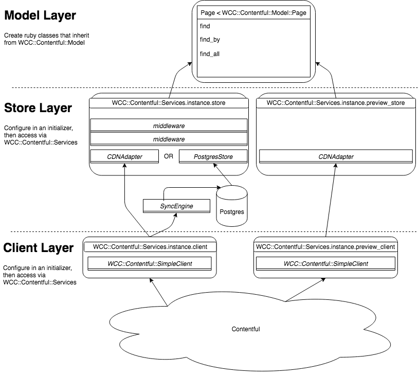

[](https://rubygems.org/gems/wcc-contentful)
[](https://circleci.com/gh/watermarkchurch/wcc-contentful)
[](https://coveralls.io/github/watermarkchurch/wcc-contentful?branch=master)

Full documentation: https://watermarkchurch.github.io/wcc-contentful/latest/wcc-contentful/

# WCC::Contentful

An alternative to Contentful's [contentful.rb ruby client](https://github.com/contentful/contentful.rb/), [contentful_model](https://github.com/contentful/contentful_model), and [contentful_rails](https://github.com/contentful/contentful_rails) gems all in one.

Table of Contents:

1. [Why?](#why-did-you-rewrite-the-contentful-ruby-stack)
2. [Installation](#installation)
3. [Configuration](#configure)
4. [Usage](#usage)
   1. [Model API](#wcccontentfulmodel-api)
      * [Rich Text Support](#rich-text-support)
   2. [Store API](#store-api)
   3. [Direct CDN client](#direct-cdn-api-simpleclient)
   4. [Accessing the APIs](#accessing-the-apis-within-application-code)
5. [Architecture](#architecture)
   1. [Client Layer](#client-layer)
   2. [Store Layer](#store-layer)
   3. [Model Layer](#model-layer)
6. [Test Helpers](#test-helpers)
7. [Advanced Configuration Example](#advanced-configuration-example)
8. [Connecting to Multiple Spaces](#connecting-to-multiple-spaces-or-environments)
9. [Development](#development)
10. [Contributing](#contributing)
11. [License](#license)


## Why did you rewrite the Contentful ruby stack?

We started working with Contentful almost 5 years ago.  Since that time, Contentful's ruby stack has improved, but there are still a number of pain points that we feel we have addressed better with our gem.  These are:

* [Low-level caching](#low-level-caching)
* [Better integration with Rails & Rails models](#better-rails-integration)
* [Automatic pagination and Automatic link resolution](#automatic-pagination-and-link-resolution)
* [Automatic webhook management](#automatic-webhook-management)

Our gem no longer depends on any of the Contentful gems and interacts directly with the [Contentful CDA](https://www.contentful.com/developers/docs/references/content-delivery-api/) and [Content Management API](https://www.contentful.com/developers/docs/references/content-management-api/) over HTTPS.

### Low-level caching

The wcc-contentful gem enables caching at two levels: the HTTP response using [Faraday HTTP cache middleware](https://github.com/sourcelevel/faraday-http-cache), and at the Entry level using the Rails cache and the [Sync API](https://www.contentful.com/developers/docs/references/content-delivery-api/#/reference/synchronization) to keep it up to date.  We've found these two cache layers to be very effective at reducing both round trip latency to the Content Delivery API, as well as reducing our monthly API request usage. (which reduces our overage charges.  Hooray!)

#### At the request/response level
By default, the contentful.rb gem requires the [HTTP library](https://rubygems.org/gems/http).  While simple and straightforward to use, it is not as powerful for caching.  We decided to make our client conform to the [Faraday gem's API](https://github.com/lostisland/faraday).  If you prefer not to use Faraday, you can choose to supply your own HTTP adapter that "quacks like" Faraday (see the [TyphoeusAdapter](https://github.com/watermarkchurch/wcc-contentful/blob/master/wcc-contentful/lib/wcc/contentful/simple_client/typhoeus_adapter.rb) for one implementation).

Using Faraday makes it easy to add Middleware.  As an example, our flagship Rails app that powers watermark.org uses the following configuration in Production, which provides us with instrumentation through statsd, logging, and caching:
```ruby
config.connection = Faraday.new do |builder|
  builder.use :http_cache,
    shared_cache: false,
    store: ActiveSupport::Cache::MemoryStore.new(size: 512.megabytes),
    logger: Rails.logger,
    serializer: Marshal,
    instrumenter: ActiveSupport::Notifications

  builder.use :gzip
  builder.response :logger, Rails.logger, headers: false, bodies: false if Rails.env.development?
  builder.request :instrumentation
  builder.adapter :typhoeus
end
```

#### At the Entry level

Our stack has three layers, the middle layer being essentially a cache for individual Entry hashes parsed out of responses from the Delivery API.  We were able to add a caching layer here which stores entries retrieved over the Sync API, and responds to queries with cached versions of local content when possible.  We consider this to be our best innovation on the Contentful ruby stack.

We have successfully created caching layers using Memcached, Postgres, and an in-memory hash.  The architecture allows other caching implementations to be created fairly easily, and we have a set of rspec specs that can verify that a cache store behaves appropriately.  For more information, [see the documentation on the caching modes here](https://watermarkchurch.github.io/wcc-contentful/latest/wcc-contentful/WCC/Contentful/Store.html).

### Better Rails Integration

When we initially got started with the Contentful ruby models, we encountered one problem that was more frustrating than all others: If a field exists in the content model, but the particular entry we're working with does not have that field populated, then accessing that field raised a `NoMethodError`.  This caused us to litter our code with `if defined?(entry.my_field)` which is bad practice.  

We decided it was better to not rely on `method_missing?` (what contentful.rb does), and instead to use `define_method` in an initializer to generate the methods for our models.  This has the advantage that calling `.instance_methods` on a model class includes all the fields present in the content model.

    Note: it appears that [contentful_rb has added an opt-in configuration to return `nil` instead of raising `NoMethodError`](https://github.com/contentful/contentful_model#returning-nil-for-fields-which-arent-defined).
    We think this should be the default setting, instead of being opt-in.

We also took advantage of Rails' naming conventions to automatically infer the content type name based on the class name.  Thus in our code, we have `app/models/page.rb` which defines `class Page << WCC::Contentful::Model::Page`, and is automatically linked to the `page` content type ID.  (Note: this is overridable on a per-model basis)

All our models are automatically generated at startup which improves response times at the expense of initialization time.  In addition, our content model registry allows easy definition of custom models in your `app/models` directory to override fields.  This plays nice with other gems like algoliasearch-rails, which allows you to declaratively manage your Algolia indexes.  Another example from our flagship watermark.org:

```ruby
class Page < WCC::Contentful::Model::Page
  include AlgoliaSearch

  algoliasearch(index_name: 'pages') do
    attribute(:title, :slug)
    ...
  end
```

### Automatic Pagination and Link Resolution

Using the `contentful_model` gem, calling `Page.all.load` does not give you all Page entries if there are more than 100.  To get the next page you must call `.paginate` on the response.  By contrast, `Page.find_all` in the `wcc-contentful` gem gives you a [Lazy Enumerator](https://ruby-doc.org/core-2.5.0/Enumerator/Lazy.html).  As you iterate past the 100th entry, the enumerator will automatically fetch the next page.  If you only enumerate 99 entries (say with `.take(99)`), then the second page will never be fetched.

Similarly, if your Page references an asset, say `hero_image`, that field returns a `Link` object rather than the actual `Asset`.  You must either predefine how many links you need using `Page.load_children(3).all.load`, or detect that `hero_image` is a `Link` like `if @page.hero_image.is_a? Contentful::Link` and then call `.resolve` on the link.  We found all of that to be too cumbersome when we are down in a nested partial view template that may be invoked from multiple places.

The `wcc-contentful` gem, by contrast, automatically resolves a link when accessing the associated attribute.  So in our example above, `wcc-contentful` will **always** return a `WCC::Contentful::Asset` when calling `@page.hero_image`, even if it has to execute a query to cdn.contentful.com in order to fetch it.

Warning: This can easily lead to you exhausting your Contentful API quota if you do not carefully tune your cache, which you should be doing anyways!  The default settings will use the Rails cache to try to cache these resolutions, but *you are ultimately responsible for how many queries you execute!*

### Automatic webhook management

The `wcc-contentful` gem, just like `contentful_rails`, provides an Engine to be mounted in your Rails routes file.  Unlike `contentful_rails`, if you also configure `wcc-contentful` with a Contentful Management Token and a public `app_url`, then on startup the `wcc-contentful` engine will reach out to the Contentful Management API and ensure that a webhook is configured to point to your app.  This is one less devops burden on you, and plays very nicely in with Heroku review apps.

## Installation

Add this line to your application's Gemfile:

```ruby
gem 'wcc-contentful', require: 'wcc/contentful/rails'
```

If you're not using rails, exclude the `require:` parameter.

```ruby
gem 'wcc-contentful'
```

And then execute:

```
$ bundle
```

Or install it yourself:

```
$ gem install wcc-contentful
```

## Configure

Put this in an initializer:

```ruby
# config/initializers/wcc_contentful.rb
WCC::Contentful.configure do |config|
  config.access_token = <CONTENTFUL_ACCESS_TOKEN>
  config.space = <CONTENTFUL_SPACE_ID>
end

WCC::Contentful.init!
```

All configuration options can be found [in the rubydoc under
WCC::Contentful::Configuration](https://watermarkchurch.github.io/wcc-contentful/latest/wcc-contentful/WCC/Contentful/Configuration)

## Usage

### WCC::Contentful::Model API

The WCC::Contentful::Model API exposes Contentful data as a set of dynamically
generated Ruby objects.  These objects are based on the content types in your
Contentful space.  All these objects are generated by `WCC::Contentful.init!`

The following examples show how to use this API to find entries of the `page`
content type:

```ruby
# app/models/page.rb
class Page < WCC::Contentful::Model::Page

  # You can add additional methods here
end

# Find objects by id
Page.find('1E2ucWSdacxxf233sfa3')
# => #<Page:0x0000000005c71a78 @created_at=2018-04-16 18:41:17 UTC...>

# Find objects by field
Page.find_by(slug: '/some-slug')
# => #<Page:0x0000000005c71a78 @created_at=2018-04-16 18:41:17 UTC...>

# Use operators to filter by a field
# must use full notation for sys attributes (except ID)
Page.find_all('sys.created_at' => { lte: Date.today })
# => [#<Page:0x0000000005c71a78 @created_at=2018-04-16 18:41:17 UTC...>, ... ]

# Nest queries to mimick joins
Page.find_by(subpages: { slug: '/some-slug' })
# => #<Page:0x0000000005c71a78 @created_at=2018-04-16 18:41:17 UTC...>

# Fetch an entry in a different locale
spanish_homepage = Page.find_by(slug: '/', options: { locale: 'es-US' })
# => #<Page:0x0000000005c71a78 @created_at=2018-04-16 18:41:17 UTC...>
spanish_homepage.title
# => Esta es la página principal

# Pass the preview flag to use the preview client (must have set preview_token config param)
preview_redirect = WCC::Contentful::Model::Redirect.find_by({ slug: 'draft-redirect' }, preview: true)
# => #<WCC::Contentful::Model::Redirect:0x0000000005d879ad @created_at=2018-04-16 18:41:17 UTC...>
preview_redirect_object.href
# => 'http://www.somesite.com/slug-for-redirect'
```

See the {WCC::Contentful::Model} documentation for more details.

#### Rich Text support

As of version 1.5.0, the Model API supports parsing and rendering Rich Text fields.

Rich Text fields are retrieved from the API and parsed into the WCC::Contentful::RichText::Document object model.
```rb
Page.find_by(slug: '/some-slug').my_rich_text
# => #<struct WCC::Contentful::RichText::Document ...
```

If you are using Rails, a rich text field can be rendered to HTML using the default renderer by
calling #to_html:
```rb
my_rich_text.to_html
# => "<div class=\"contentful-rich-text\"><h2>Dear Watermark Family,</h2>
```

If you are not using Rails, or if you want to override the default rendering behavior, you need to set the
WCC::Contentful::Configuration#rich_text_field configuration option:
```rb
# lib/my_rich_text_renderer
class MyRichTextRenderer < WCC::Contentful::ActionViewRichTextRenderer
  def render_hyperlink(node)
    # override the default logic for rendering hyperlinks
  end
end

# config/initializers/wcc_contentful.rb
WCC::Contentful.configure do |config|
  config.rich_text_renderer = MyRichTextRenderer
end
```

If you want to construct and render WCC::Contentful::RichText::Document objects directly, the #to_html method will
raise an error.  Instead, you will need to construct and invoke your renderer directly.
```rb
my_document = WCC::Contentful::RichText.tokenize(JSON.parse(...contentful CDN rich text field representation...))
# => #<struct WCC::Contentful::RichText::Document ...

renderer = MyRichTextRenderer.new(my_document,
  # (optional) inject services so the renderer can automatically resolve links to entries and assets.
  # The renderer still works without this, but hyperlinks which reference Assets or Entries will raise an error.
  config: WCC::Contentful.configuration,
  store: WCC::Contentful::Services.instance.store,
  model_namespace: WCC::Contentful::Model)
# => #<MyRichTextRenderer:0x0000000005c71a78

renderer.call
# => "<div class=\"contentful-rich-text\"><h2>Dear Watermark Family,</h2>
```

### Store API

The Store layer is used by the Model API to access Contentful data in a raw form.
The Store layer returns entries as hashes parsed from JSON, conforming to the
object structure returned from the Contentful CDN.

The following examples show how to use the Store API to retrieve raw data from
the store:

```ruby
store = WCC::Contentful::Services.instance.store
# => #<WCC::Contentful::Store::CDNAdapter:0x00007fb92a221498

store.find('5FsqsbMECsM62e04U8sY4Y')
# => {"sys"=>
#  ...
# "fields"=>
# ...}

store.find_by(content_type: 'page', filter: { slug: '/some-slug' })
# => {"sys"=>
#  ...
# "fields"=>
# ...}

query = store.find_all(content_type: 'page').eq('group', 'some-group')
# => #<WCC::Contentful::Store::CDNAdapter::Query:0x00007fa3d40b84f0
query.first
# => {"sys"=>
#  ...
# "fields"=>
# ...}
query.result
# => #<Enumerator::Lazy: ...>
query.result.force
# => [{"sys"=> ...}, {"sys"=> ...}, ...]
```

The store layer, while superficially similar to the Contentful API, tries to present a different "View" over the data
which is more compatible with the Model layer.  It resolves includes by actually replacing the in-memory `Link` objects
with their linked `Entry` representations.  This lets you traverse the links naturally using `#dig` or `#[]`:

```ruby
# Include to a depth of 3 to make sure it's included
homepage = store.find_by(slug: '/', include: 3)
# Traverse through the top nav menu => menu button 0 => about page
about_page = homepage.dig('fields', 'nav_menu', 'fields', 'buttons', 0, 'fields', 'page')
```


See the {WCC::Contentful::Store} documentation for more details.

### Direct CDN API (SimpleClient)

The SimpleClient is the bottom layer, and is used to get raw data directly from
the Contentful CDN.  It handles response parsing and paging, but does not resolve
links or transform the result into a Model class.

The following examples show how to use the SimpleClient to retrieve data directly
from the Contentful CDN:

```ruby
client = WCC::Contentful::Services.instance.client
# => #<WCC::Contentful::SimpleClient::Cdn:0x00007fa3cde89310

response = client.entry('5FsqsbMECsM62e04U8sY4Y')
# => #<WCC::Contentful::SimpleClient::Response:0x00007fa3d103a4e0
response.body
# => "{\n  \"sys\": {\n ...
response.raw
# => {"sys"=>
#  ...
# "fields"=>
# ...}

client.asset('5FsqsbMECsM62e04U8sY4Y').raw
# => {"sys"=>
#  ...
# "fields"=>
# ...}

response = client.entries('fields.group' => 'some-group', 'limit' => 5)
# => #<WCC::Contentful::SimpleClient::Response:0x00007fa3d103a4e0
response.count
# => 99
response.first
# => {"sys"=>
#  ...
# "fields"=>
# ...}
response.items
=> #<Enumerator::Lazy: ...>
response.items.count  # Careful! This evaluates the lazy iterator and gets all pages
# => 99

response.includes
# => {"4xNnFJ77egkSMEogE2yISa"=>
#   {"sys"=> ...}
#  "6Fwukxxkxa6qQCC04WCaqg"=>
#   {"sys"=> ...}
#   ...}
```

The client handles Paging automatically within the lazy iterator returned by #items.
This lazy iterator does not respect the `limit` param - that param is only passed
through to the API to set the page size.  If you truly want a limited subset of
response items, use [`response.items.take(n)`](https://ruby-doc.org/core-2.5.3/Enumerable.html#method-i-take)

Entries included via the `include` parameter are made available on the #includes
field.  This is a hash of `<entry ID> => <raw entry>` and makes it easy to grab
links.  This hash is added to lazily as you enumerate the pages.

See the {WCC::Contentful::SimpleClient} documentation for more details.

### Accessing the APIs within application code

The Model API is best exposed by defining your own model classes in the `app/models`
directory which inherit from the WCC::Contentful models.

```ruby
# app/models/page.rb
class Page < WCC::Contentful::Model::Page

  # You can add additional methods here
end

# app/controllers/pages_controller.rb
class PagesController < ApplicationController
  def show
    @page = Page.find_by(slug: params[:slug])
    raise Exceptions::PageNotFoundError, params[:slug] unless @page
  end
end
```

The {WCC::Contentful::Services} singleton gives access to the other configured services.
You can also include the {WCC::Contentful::ServiceAccessors} concern to define these
services as attributes in a class.

```ruby
class MyJob < ApplicationJob
  include WCC::Contentful::ServiceAccessors

  def perform
    Page.find(...)

    store.find(...)

    client.entries(...)
  end
end
```

## Architecture



From the bottom up:

### Client Layer

The {WCC::Contentful::SimpleClient} provides methods to access the [Contentful
Content Delivery API](https://www.contentful.com/developers/docs/references/content-delivery-api/)
through your favorite HTTP client gem.  The SimpleClient expects
an Adapter that conforms to the Faraday interface.

Creating a SimpleClient to connect using different credentials, or to connect
without setting up all the rest of WCC::Contentful, is easy:

```ruby
WCC::Contentful::SimpleClient::Cdn.new(
  # required
  access_token: 'xxxx',
  space: '1234',
  # optional
  environment: 'staging', # omit to use master
  rate_limit_wait_timeout: 10,
  instrumentation: ActiveSupport::Notifications,
  connection: Faraday.new { |builder| ... },
)
```

You can also create a {WCC::Contentful::SimpleClient::Preview} to talk to the
Preview API, or a {WCC::Contentful::SimpleClient::Management} to talk to the
Management API.

### Store Layer

The Store Layer represents the data store where Contentful entries are kept for
querying.  By default, `WCC::Contentful.init!` creates a {WCC::Contentful::Store::CDNAdapter}
which uses a {WCC::Contentful::SimpleClient::Cdn} instance to query entries from
the [Contentful Content Delivery API](https://www.contentful.com/developers/docs/references/content-delivery-api/).  You can also query entries from another
source like Postgres or an in-memory hash if your data is small enough.

You can also implement your own store if you want!  The gem contains a suite of
RSpec shared examples that give you a baseline for implementing your own store.
In your RSpec suite:
```ruby
# frozen_string_literal: true

require 'my_store'
require 'wcc/contentful/store/rspec_examples'

RSpec.describe MyStore do
  it_behaves_like 'contentful store', {
    # Set which store features your store implements.
    nested_queries: true,  # Does your store implement JOINs?
    include_param: true    # Does your store resolve links when given the :include option?
  }
```

The store is kept up-to-date by the {WCC::Contentful::SyncEngine}.  The `SyncEngine#next` methodcalls the `#index` method on the configured store in order to update
it with the latest data via the [Contentful Sync API](https://www.contentful.com/developers/docs/references/content-delivery-api/#/reference/synchronization).  For example,
the {WCC::Contentful::Store::MemoryStore} uses this to update the hash with the
newest version of an entry, or delete an entry out of the hash.

#### Store Middleware

The store layer is made up of a base store (which implements {WCC::Contentful::Store::Interface}),
and some required middleware.  The list of default middleware applied to each store is found in
{WCC::Contentful::Store::Factory.default_middleware}

To create your own middleware simply include {WCC::Contentful::Middleware::Store}.  Then you can optionally implement
the `#transform` and `#select?` methods:

```ruby
class MyMiddleware
  include WCC::Contentful::Middleware::Store

  # Called for each entry that is requested out of the backing store.  You can modify the entry and return it to the
  # next layer.
  def transform(entry, options)
    # Do something with the entry...
    # Make sure you return it at the end!
    entry
  end

  def select?(entry, options)
    # Choose whether this entry should exist or not.  If you return false here, then the entry will act as though it
    # were archived in Contentful.
    entry.dig('fields', 'hide_until') > Time.zone.now
  end
end
```

You can also override any of the standard Store methods.

To apply the middleware, call `use` when configuring the store:

```ruby
config.store :direct do
  use MyMiddleware, param1: 'xxx'
end
```

The most useful middleware is the {WCC::Contentful::Middleware::Store::CachingMiddleware},
which enables `:lazy_sync` mode (see {WCC::Contentful::Configuration#store})

### Model Layer

This is the global top layer where your Rails app looks up content similarly to
ActiveModel.  The models are namespaced under the root class {WCC::Contentful::Model}.
Each model's implementation of `.find`, `.find_by`, and `.find_all` simply call
into the configured Store.

Models can be initialized directly with the `.new` method, by passing in a hash:
```ruby
entry = { 'sys' => ..., 'fields' => ... }
Page.new(entry)
```

**The initializer must receive a localized entry**.  An entry found using a `locale=*` query
must be transformed to a localized entry using the {WCC::Contentful::EntryLocaleTransformer} before
passing it to your model:

```ruby
entry = client.entry('1234', locale: '*').raw
localized_entry = WCC::Contentful::EntryLocaleTransformer.transform_to_locale(entry, 'en-US')
Page.new(localized_entry)
```

The Store layer ensures that localized entries are returned using the {WCC::Contentful::Middleware::Store::LocaleMiddleware}.

The main benefit of the Model layer is lazy link resolution.  When a model's
property is accessed, if that property is a link that has not been resolved
yet (for example using the `include: n` parameter on `.find_by`), the model
will automatically call `#find` on the store to resolve that linked entry.

Note that this can easily result in lots of CDN calls to Contentful!  To optimize
this you should use the `include` parameter and/or use a different store.

## Test Helpers

To use the test helpers, include the following in your rails_helper.rb:

```ruby
require 'wcc/contentful/rspec'
```

This adds the following helpers to all your specs:

```ruby
##
# Builds a in-memory instance of the Contentful model for the given content_type.
# All attributes that are known to be required fields on the content type
# will return a default value based on the field type.
instance = contentful_create('my-content-type', my_field: 'some-value')
# => #<WCC::Contentful::Model::MyContentType:0x0000000005c71a78 @created_at=2018-04-16 18:41:17 UTC...>

instance.my_field
# => "some-value"

instance.other_required_field
# => "default-value"

instance.other_optional_field
# => nil

instance.not_a_field
# NoMethodError: undefined method `not_a_field' for #<MyContentType:0x00007fbac81ee490>

##
# Builds a rspec double of the Contentful model for the given content_type.
# All attributes that are known to be required fields on the content type
# will return a default value based on the field type.
dbl = contentful_double('my-content-type', my_field: 'other-value')
# => #<Double (anonymous)>

dbl.my_field
# => "other-value"

dbl.other_optional_field
# => nil

dbl.not_a_field
# => #<Double (anonymous)> received unexpected message :not_a_field with (no args)

##
# Builds out a fake Contentful entry for the given content type, and then
# stubs the Model API to return that content type for `.find` and `.find_by`
# query methods.
stubbed = contentful_stub('my-content-type', id: '1234', my_field: 'test')

WCC::Contentful::Model.find('1234') == stubbed
# => true

MyContentType.find('1234') == stubbed
# => true

MyContentType.find_by(my_field: 'test') == stubbed
# => true
```

## Advanced Configuration Example

Here's an example containing all the configuration options, and a sample setup for
automatic deployment to Heroku.  This is intended to make you aware of what is possible,
and not as a general recommendation of what your setup should look like.

```ruby
# config/initializers/wcc_contentful.rb
WCC::Contentful.configure do |config|
  config.access_token = ENV['CONTENTFUL_ACCESS_TOKEN']
  config.space = ENV['CONTENTFUL_SPACE_ID']
  config.environment = ENV['CONTENTFUL_ENVIRONMENT']
  config.preview_token = ENV['CONTENTFUL_PREVIEW_ACCESS_TOKEN']

  # You may or may not want to provide this to your production server...
  config.management_token = ENV['CONTENTFUL_MANAGEMENT_TOKEN'] unless Rails.env.production?

  config.app_url = "https://#{ENV['HOSTNAME']}"
  config.webhook_username = 'my-app-webhook'
  config.webhook_password = Rails.application.secrets.webhook_password
  config.webhook_jobs << MyOnWebhookJob

  config.store = :lazy_sync, Rails.cache if Rails.env.production?
  # config.store = MyCustomStore.new

  # Use a custom Faraday connection
  config.connection = Faraday.new do |builder|
    f.request :retry
    f.request MyFaradayRequestAdapter.new
    ...
  end
  # OR implement some adapter like this to use another HTTP client
  config.connection = MyNetHttpAdapter.new

  config.update_schema_file = :never
end

WCC::Contentful.init!
```

For Heroku:

```yaml
# Procfile
web: bundle exec rails s
worker: bundle exec sidekiq
release: bin/release
```

```sh
# bin/release
#!/bin/sh

set -e

echo "Migrating database..."
bin/rake db:migrate

echo "Migrating contentful..."
migrations_to_be_run=$( ... ) # somehow figure this out
node_modules/.bin/contentful-migration \
    -s $CONTENTFUL_SPACE_ID -a $CONTENTFUL_MANAGEMENT_TOKEN \
    -y -p "$migrations_to_be_run"

echo "Updating schema file..."
rake wcc_contentful:download_schema
```

All configuration options can be found [in the rubydoc](https://www.rubydoc.info/gems/wcc-contentful/WCC/Contentful/Configuration) under
{WCC::Contentful::Configuration}

## Connecting to multiple spaces or environments

When initializing the WCC::Contentful gem using `WCC::Contentful.init!`, the gem will by default connect to the single
Contentful space that you specify in the `WCC::Contentful.configure` step.  However the gem is also capable of connecting
to multiple spaces within the same ruby process!  You just have to create and initialize a namespace.

The {WCC::Contentful::ModelAPI} concern makes this straightforward.  Start by creating your Namespace
and including the concern:
```ruby
# lib/my_second_space.rb

# Note: This class must be in the "lib" folder in :zeitwerk mode, otherwise Rails 6+ will unload all your constants
# that were created in the initializer.  Your models which subclass this namespace may reside in the app/models directory.
class MySecondSpace
  include WCC::Contentful::ModelAPI
end

# app/models/other_page.rb
class OtherPage < MySecondSpace::Page
end
```

Then configure it in an initializer:
```ruby
# config/initializers/my_second_space.rb
MySecondSpace.configure do |config|
  # Make sure to point to a different schema file from your first space!
  config.schema_file = Rails.root.join('db/second-contentful-schema.json')

  config.access_token = ENV['SECOND_CONTENTFUL_ACCESS_TOKEN']
  config.preview_token = ENV['SECOND_CONTENTFUL_PREVIEW_ACCESS_TOKEN']
  config.space = ENV['SECOND_CONTENTFUL_SPACE_ID']
  config.environment = ENV['CONTENTFUL_ENVIRONMENT']
end

# Ensure that models are reloaded in Rails development mode
Rails.application.config.to_prepare do
  MySecondSpace.reload!
end
```

Finally, use it:
```ruby
OtherPage.find('1234')
# GET https://cdn.contentful.com/spaces/other-space/environments/other-env/entries/1234
# => #<OtherPage:0x0000000005c71a78 @created_at=2018-04-16 18:41:17 UTC...>

Page.find('1234')
# GET https://cdn.contentful.com/spaces/first-space/environments/first-env/entries/1234
# => #<Page:0x0000000001271b70 @created_at=2018-04-15 12:02:14 UTC...>
```

The ModelAPI defines a second stack of services that you can access for lower level connections:
```ruby
store = MySecondSpace.services.store
# => #<WCC::Contentful::Store::CDNAdapter:0x00007f888edac118
client = MySecondSpace.services.client
# => #<WCC::Contentful::SimpleClient::Cdn:0x00007f88942a8888
preview_client = MySecondSpace.services.preview_client
# => #<WCC::Contentful::SimpleClient::Preview:0x00007f888ccafa00
sync_engine = MySecondSpace.services.sync_engine
# => #<WCC::Contentful::SyncEngine:0x00007f88960b6b40
```
Note that the above services are not accessible on {WCC::Contentful::Services.instance}
or via the {WCC::Contentful::ServiceAccessors}.

#### Important Note when using Zeitwerk with Rails 6+
When using Rails >= 6 with `config.autoloader = :zeitwerk`, Rails will remove any models defined in `app/models` after
initialization and then load them again when they are referenced.  If you `include WCC::Contentful::ModelAPI` in a class
defined inside the `app` directory, this will have the effect of deleting all configuration that was set in the initializer
as well as the constants generated from your schema.
This will result in one of two errors:

* `NameError (uninitialized constant MySecondSpace::MyContentType)`
    if you try to reference a subclass such as `MyContentType < MySecondSpace::MyContentType`
* `ArgumentError (Not yet configured!)`
    if you try to `MySecondSpace.find('xxxx')` to load an Entry or Asset

The solution is to have your secondary namespace in a folder which is not in the `autoload_paths`.
We suggest using `lib`, which will work so long as you have not added the `lib` folder to the `autoload_paths` as some
uninformed StackOverflow answers suggest you do.

### Using a sync store with a second space

If you use something other than the CDNAdapter with your second space, you will
need to find a way to trigger `MySecondSpace.services.sync_engine.next` to keep
it up-to-date.  The {WCC::Contentful::Engine} will only manage the global SyncEngine
configured by the global {WCC::Contentful.configure}.

The easiest way to do this is to set up your own Rails route to respond to Contentful
webhooks and then configure the second Contentful space to send webhooks to this route.
You could also do this by triggering it periodically in a background job using
Sidekiq and [sidekiq-scheduler](https://github.com/Moove-it/sidekiq-scheduler).

## Development

After checking out the repo, run `bin/setup` to install dependencies. Then, run `bundle exec rspec` to run the tests. You can also run `bin/console` for an interactive prompt that will allow you to experiment.

## Contributing

Bug reports and pull requests are welcome on GitHub at https://github.com/watermarkchurch/wcc-contentful.

The developers at Watermark Community Church have pledged to govern their interactions with each other, with their clients, and with the larger wcc-contentful user community in accordance with the "instruments of good works" from chapter 4 of The Rule of St. Benedict (hereafter: "The Rule"). This code of ethics has proven its mettle in thousands of diverse communities for over 1,500 years, and has served as a baseline for many civil law codes since the time of Charlemagne.

[See the full Code of Ethics](https://github.com/watermarkchurch/wcc-contentful/blob/master/CODE_OF_ETHICS.md)

## License

The gem is available as open source under the terms of the [MIT License](http://opensource.org/licenses/MIT).
